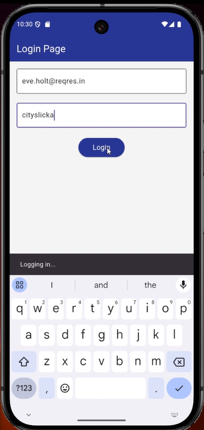

# Auth_Secure_Storage

A new Flutter project that provides secure storage functionality for user authentication.

## Overview

Auth-Secure-Storage is a Flutter app designed to handle secure user authentication using secure storage techniques. It stores user authentication data in a secure and encrypted storage system to ensure privacy and data integrity.

## Getting Started

This project is a starting point for a Flutter application.

A few resources to get you started if this is your first Flutter project:

- [Lab: Write your first Flutter app](https://docs.flutter.dev/get-started/codelab)
- [Cookbook: Useful Flutter samples](https://docs.flutter.dev/cookbook)

For help getting started with Flutter development, view the
[online documentation](https://docs.flutter.dev/), which offers tutorials,
samples, guidance on mobile development, and a full API reference.

## Features

- Securely store user authentication tokens.
- Use `flutter_secure_storage` for data encryption.
- Allow easy user login and logout functionality.

